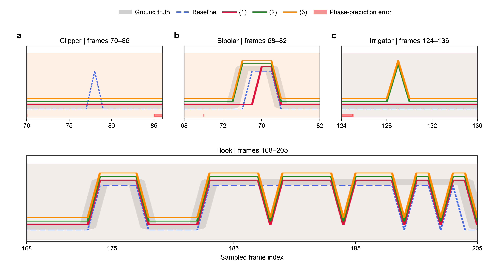
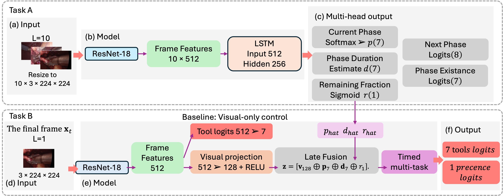
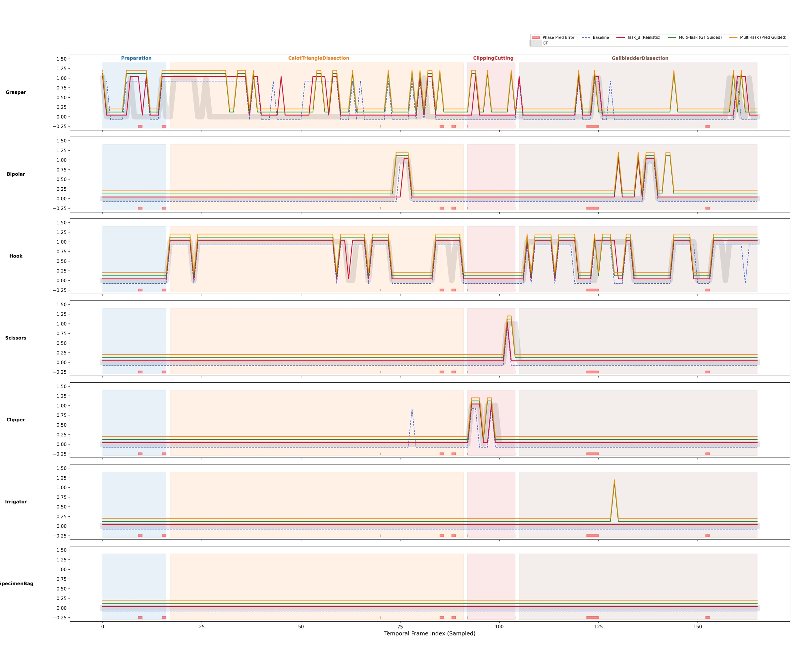
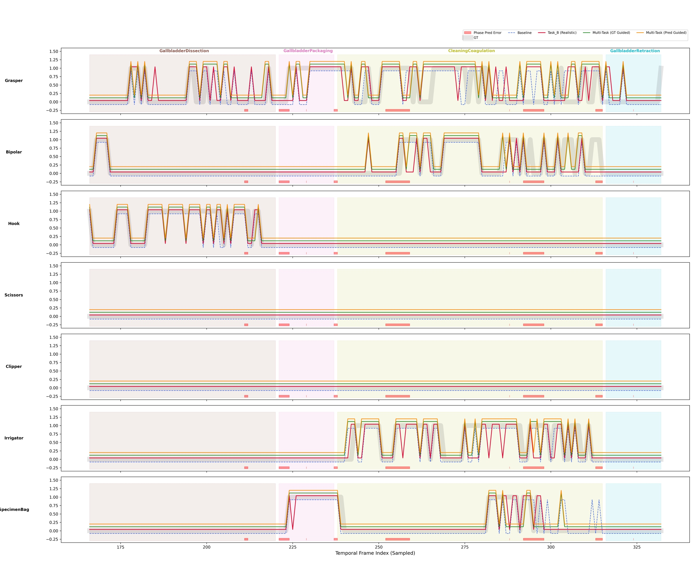

# Surgical Workflow and Tool Recognition

A two-stage PyTorch research pipeline for **surgical workflow estimation** and
**frame-level, multi-label instrument recognition** on Cholec80. The project
tests whether phase and progress context can complement the visual appearance
of the current frame when identifying seven surgical tools.



*Selected intervals from test video 49. The traces compare ground truth, a
visual-only baseline, single-task label-guided recognition (1), multi-task
label-guided recognition (2), and multi-task prediction-guided recognition
(3). Red markers indicate Task A phase-prediction errors. These intervals are
illustrative examples, not test-set-wide evidence of superiority.*

## What the pipeline does

The project separates workflow understanding from tool recognition:

1. **Task A — workflow context.** A 10-frame window is encoded frame by frame
   with an ImageNet-pretrained ResNet-18. A one-layer LSTM then predicts the
   current phase, next phase, which phases occur in the video, the duration
   ratio of each phase, and the remaining fraction of the current phase.
2. **Task B — tool recognition.** A separate ResNet-18 encodes only the final
   frame. The visual representation is used alone as a baseline or fused with
   a 15-dimensional workflow descriptor: 7 phase probabilities, 7 phase
   duration ratios, and 1 remaining-phase fraction.

The next-phase and phase-existence outputs regularize Task A but are not passed
to Task B. The multi-task Task B variant adds a binary auxiliary head for
whether **any** annotated tool is visible; this is different from Task A's
phase-existence prediction.



*Architecture overview. The tool-presence auxiliary head is used only by the
multi-task Task B configurations.*

### Compared Task B configurations

| Configuration | Workflow input | Prediction heads | Interpretation |
|---|---|---|---|
| Visual baseline | None | 7 tool logits | Pure final-frame control |
| (1) Label-guided | Ground-truth phase, duration ratios, and remaining fraction | 7 tool logits | Oracle/reference configuration |
| (2) Multi-task label-guided | Same ground-truth descriptor | 7 tool logits + any-tool presence | Oracle/reference configuration |
| (3) Multi-task prediction-guided | Frozen Task A predictions | 7 tool logits + any-tool presence | Deployable-prior experiment |

The label-guided variants use information derived from annotations, including
complete-video phase durations and future phase boundaries. They should be
read as upper-bound references, not realistic inference systems.

## Results at a glance

The values below are the recorded report results for the fixed 40/8/32
video-level split. They were transcribed for project documentation; full
training was not rerun during repository cleanup.

### Task A: workflow context

| Metric | Result |
|---|---:|
| Current-phase accuracy | 79.93% |
| Current-phase macro F1 | 73.05% |
| Next-phase accuracy | 72.68% |
| Phase-existence macro F1 | 97.44% |
| Current-phase remaining-ratio MAE | 21.45 percentage points |
| Phase-duration-ratio MAE | 6.20 percentage points |

The duration and remaining-ratio errors are evaluated across sampled windows
against labels derived from the full video; they are not per-video aggregated
metrics.

### Task B: seven-tool multi-label recognition

| Model | mAP | Macro F1 |
|---|---:|---:|
| Visual baseline | 0.8586 | **0.8049** |
| (1) Label-guided | **0.8620** | 0.8009 |
| (2) Multi-task label-guided | 0.8479 | 0.7977 |
| (3) Multi-task prediction-guided | 0.8386 | 0.7724 |

The result is deliberately mixed: label guidance produced the highest mAP by
a small margin, while the visual baseline retained the highest macro F1. The
prediction-guided multi-task model did not match the corresponding
label-guided model. In this experiment, workflow context changed local tool
behaviour but did **not** provide a consistent aggregate improvement.

<details>
<summary>Per-tool F1 scores</summary>

| Tool | Baseline | (1) Label-guided | (2) Multi-task label-guided | (3) Multi-task prediction-guided |
|---|---:|---:|---:|---:|
| Grasper | **0.8028** | 0.7977 | 0.7874 | 0.7811 |
| Bipolar | 0.8417 | **0.8506** | 0.8350 | 0.8100 |
| Hook | **0.9477** | 0.9459 | 0.9429 | 0.9455 |
| Scissors | 0.5948 | 0.6000 | **0.6075** | 0.4938 |
| Clipper | **0.8200** | 0.7975 | 0.8080 | 0.7886 |
| Irrigator | 0.7630 | **0.7637** | 0.7633 | 0.7440 |
| Specimen bag | **0.8645** | 0.8510 | 0.8398 | 0.8439 |

</details>

<details>
<summary>Open the full qualitative timeline for test video 49</summary>



*Early portion of video 49. Phase-coloured backgrounds provide workflow
context; the curves compare ground truth and the four Task B configurations.*



*Late portion of video 49. Red bars mark locations where Task A predicted an
incorrect surgical phase.*

</details>

## Quick start

### 1. Install the environment

```bash
git clone git@github.com:zjy5566/surgical-workflow-and-tool-recognition.git
cd surgical-workflow-and-tool-recognition
python -m venv .venv
source .venv/bin/activate
python -m pip install --upgrade pip
python -m pip install -r requirements.txt
```

`requirements.txt` also retains TensorFlow and setuptools for the vendored
TF-Cholec80 loader. The main pipeline is PyTorch-based and does not import that
loader. PyTorch installation can be platform-specific; use the official
PyTorch selector when a particular CUDA build is required. The first model
initialization may download ResNet-18 ImageNet weights.

### 2. Prepare authorized Cholec80 data

The dataset is not distributed here. Request access and review the terms on the
[official CAMMA dataset page](https://camma.unistra.fr/datasets/).

The main loader expects pre-extracted one-frame-per-second PNGs and the original
tab-separated annotations in this layout:

```text
<cholec80_dir>/
├── frames/
│   ├── video01/
│   │   ├── video01_000001.png
│   │   ├── video01_000002.png
│   │   └── ...
│   └── video80/
├── phase_annotations/
│   ├── video01-phase.txt
│   └── ...
└── tool_annotations/
    ├── video01-tool.txt
    └── ...
```

The implementation aligns extracted image index `n` with annotation frame
`n × 25`, so filenames must be consecutive and begin at `000001`.

Create the local path configuration:

```bash
cp tf_cholec80/configs/config.example.json tf_cholec80/configs/config.json
```

Then edit the generated file:

```json
{
  "cholec80_dir": "/absolute/path/to/authorized/cholec80"
}
```

The real config is ignored by Git to prevent local paths from being published.

## Run the experiments

Run commands from the repository root because the scripts use relative paths.
For controlled runs, execute the stages separately:

```bash
# Task A: required before prediction-guided training
python train/train_A.py

# Task B controls and variants
python train/train_baseline.py
python train/Timed_Label_Guided.py
python train/Timed_Multi_Task_Label-Guided.py
python train/Timed_Multi_Task_Pred-Guided.py

# Evaluation and video-49 timelines
python test.py
python visualization.py
```

The prediction-guided trainer requires
`checkpoints_A/best_task_a.pth`. In the preserved implementation, a missing
Task A checkpoint produces a warning but training continues with frozen random
weights, so verify the checkpoint before running that stage.

To reproduce the complete sequence automatically:

```bash
python run.py
```

This is a full training pipeline, not a quick demo: it launches five training
jobs of up to 50 epochs each, then evaluation and visualization. Default values
(`batch_size=64`, 10 frames per sample, `num_workers=16`) are demanding,
especially on a Mac where the code currently selects CPU rather than MPS. Edit
`config.py` for the available hardware.

### Expected outputs

| Output | Default location |
|---|---|
| Task A checkpoint and curves | `checkpoints_A/` |
| Visual baseline checkpoint and curves | `checkpoints_baseline/` |
| Single-task label-guided checkpoint and curves | `checkpoints_B/` |
| Multi-task checkpoints and curves | `checkpoints_B_Multi/` |
| Test metrics | `test_results_MMDD_HHMM.log` |
| Full timeline figures | `visualization/` |

Checkpoints are not included. `test.py` silently skips most models whose files
are absent, while `visualization.py` expects all default checkpoint files.

## Reproduction defaults

| Setting | Value |
|---|---|
| Split | videos 1–40 train, 41–48 validation, 49–80 test |
| Input | 10 consecutive sampled frames, resized to 224 × 224 |
| Window stride | 1 train, 5 validation/test |
| Task B image | final frame of the 10-frame window |
| Normalization | ImageNet mean and standard deviation |
| Training augmentation | sequence-consistent colour jitter, horizontal flip, and ±10° rotation |
| Optimizer | Adam with cosine annealing to `1e-6` |
| Learning rate | `1e-4` Task A, `1e-5` Task B |
| Maximum epochs | 50 per model |
| Tool threshold | sigmoid probability ≥ 0.5 |

<details>
<summary>Phase and tool labels</summary>

**Phases:** Preparation, Calot triangle dissection, clipping and cutting,
gallbladder dissection, gallbladder packaging, cleaning and coagulation, and
gallbladder retraction.

**Tools:** Grasper, Bipolar, Hook, Scissors, Clipper, Irrigator, and Specimen
Bag.

</details>

## Repository map

```text
config.py                         shared classes and hyperparameters
dataset.py                        PNG/TXT sequence loader and augmentations
model.py                          Task A, baseline, and guided Task B models
train/                            five training entry points
test.py                           checkpoint evaluation
visualization.py                  full tool-presence timelines for one video
run.py                            complete sequential experiment runner
tf_cholec80/dataset.py            retained third-party TensorFlow loader
assets/                           README figures derived from the experiment
```

## Known limitations

- Results come from one fixed split, without cross-validation or reported seed
  control; dependencies are not version-pinned and no checkpoints are shared.
- Label-guided configurations use future/full-video annotation information and
  are oracle references. Only configuration (3) uses predicted workflow input.
- `dataset.py` uses the first `sequence.index()` match when a phase repeats,
  which can assign the wrong next phase to a later occurrence.
- The preserved visualization passes Task A predictions to the single-task
  label-guided model, creating a train/inference prior mismatch for that curve.
- Task A duration and progress errors are pooled over sampled windows rather
  than aggregated once per video.
- The qualitative figures show one test video and should not be generalized to
  the complete test set.
- This is educational/research software and has not been validated for
  real-time or clinical use.

## Data, figures, and licensing

No Cholec80 videos, extracted frames, annotations, model weights, logs, or
course report are included. The documentation figures are experiment-derived
and are not covered by the MIT License for the student-authored source code;
their reuse remains subject to the Cholec80 terms and applicable coursework
conditions.

`tf_cholec80/dataset.py` is a retained third-party file from
[CAMMA's TF-Cholec80 project](https://github.com/CAMMA-public/TF-Cholec80) and
remains under CC BY-NC-SA 4.0. It is not used by the main PyTorch pipeline.

The independently authored project code is available under the
[MIT License](LICENSE). MIT does **not** cover `tf_cholec80/dataset.py`,
Cholec80 data, medical-image pixels, figures in `assets/`, coursework
materials, model outputs, or third-party dependencies. See
[NOTICE.md](NOTICE.md) for the precise file scope, provenance, and third-party
terms.

## Source provenance

The project code preserves the original assessed-work source layout. Personal
paths, data, checkpoints, reports, submissions, and duplicate result exports
were excluded. `SOURCE_CHECKSUMS.sha256` records the retained source files, and
`instruction.txt` remains available as the original run note. See `NOTICE.md`
for the detailed provenance and third-party boundary.
